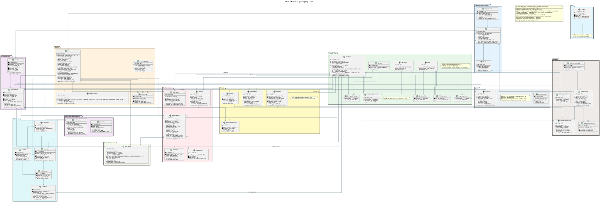

# M3301-Bigulov-backend

Backend for Medical Information System powered by Kotlin and Micronaut

## Documentation

| Resource | Description |
| -------- | ----------- |
| [docs/README.md](docs/README.md) | Documentation index and project layout overview |
| [docs/openapi.yaml](docs/openapi.yaml) | OpenAPI 3.1: REST `/api/**` routes, auth, RBAC (`x-required-permission`), GraphQL/Swagger notes |
| [docs/erd.puml](docs/erd.puml) | PlantUML database ERD (render locally; exported diagram: [`mis_erd.svg`](./mis_erd.svg)) |

## ERD (Data Model)



---

## Domain and Entities

**Domain:** Medical Information System (MIS) for managing a multi-branch healthcare organization. It covers patient registration, appointments, clinical documentation, laboratory orders, payments, inventory, notifications, and integrations with external systems (SMS, labs, government).

### Core entities

| Entity                 | Description                                                                         |
| ---------------------- | ----------------------------------------------------------------------------------- |
| **Organization**       | Healthcare organization (name, OKPO/OKUD codes, address).                           |
| **Branch**             | Physical location/facility within an organization.                                  |
| **Room**               | Consulting or treatment room within a branch.                                       |
| **Employee**           | Staff member (doctor, nurse, etc.) with credentials and optional digital signature. |
| **Specialty**          | Medical specialty (e.g., cardiology).                                               |
| **Role**               | Security role (doctor, admin, etc.).                                                |
| **Permission**         | Fine-grained permission code.                                                       |
| **EmployeeSpecialty**  | Links employees to their specialties.                                               |
| **EmployeeBranch**     | Links employees to branches.                                                        |
| **EmployeeRole**       | Links employees to roles.                                                           |
| **RolePermission**     | Links roles to permissions.                                                         |
| **EmployeePermission** | Per-employee permission overrides (grant/revoke).                                   |

### Patients and consent

| Entity             | Description                                                                          |
| ------------------ | ------------------------------------------------------------------------------------ |
| **Patient**        | Patient with demographics (card number, OMS policy, SNILS, addresses, contact info). |
| **PatientTagType** | Tag category (VIP, diabetic, etc.).                                                  |
| **PatientTag**     | Tag applied to a patient.                                                            |
| **PatientConsent** | Consent record (e.g., gov data transfer, marketing).                                 |

### Scheduling and services

| Entity                 | Description                                                       |
| ---------------------- | ----------------------------------------------------------------- |
| **Service**            | Billable service (consultation, procedure) with price per branch. |
| **TimeSlot**           | Slots in a calendar (employee, room, branch, date, time).         |
| **Appointment**        | Visit appointment (patient, doctor, slot, status, source).        |
| **AppointmentService** | Services rendered during an appointment (quantity, price).        |

### Clinical documentation

| Entity            | Description                                                               |
| ----------------- | ------------------------------------------------------------------------- |
| **MedicalRecord** | Visit record (complaints, anamnesis, examination, epicrisis, signatures). |
| **Template**      | Document template (standard, clinical guideline, personal).               |
| **Diagnosis**     | ICD diagnosis linked to a medical record.                                 |
| **Prescription**  | Prescription (procedure, medication, lab test).                           |
| **InsertSheet**   | Scanned form/insert (referral, etc.) for a patient visit.                 |

### Laboratory

| Entity           | Description                                                      |
| ---------------- | ---------------------------------------------------------------- |
| **Laboratory**   | External lab (name, integration config).                         |
| **LabTest**      | Laboratory test definition and price.                            |
| **LabOrder**     | Order for lab tests (linked to medical record, patient, doctor). |
| **LabOrderItem** | Single test in an order.                                         |
| **LabResult**    | Result for one order item (manual or from integration).          |

### Finance

| Entity           | Description                                                |
| ---------------- | ---------------------------------------------------------- |
| **Payment**      | Payment for an appointment (amount, method, status).       |
| **SalaryRecord** | Employee salary/compensation record per branch and period. |

### Inventory

| Entity                   | Description                                                    |
| ------------------------ | -------------------------------------------------------------- |
| **InventoryCategory**    | Category of inventory items.                                   |
| **InventoryItem**        | Stock item (by category, branch, room) with quantity and cost. |
| **InventoryOperation**   | Stock movement (incoming, write-off) with quantity.            |
| **InventoryAccess**      | Access rules (by employee or role) to inventory categories.    |
| **ServiceInventoryItem** | Quantity of inventory consumed per service.                    |

### Attachments and integrations

| Entity           | Description                                               |
| ---------------- | --------------------------------------------------------- |
| **Attachment**   | File attached to patient, appointment, or medical record. |
| **Integration**  | External integration (SMS, lab, gov system) with config.  |
| **Notification** | Outbound notification (SMS, email) for appointments.      |

### System

| Entity            | Description                                                                         |
| ----------------- | ----------------------------------------------------------------------------------- |
| **AuditLog**      | Audit trail for medical records: action, entity type/ID, old/new value (JSONB), IP, User-Agent, timestamp. |
| **SystemSetting** | Key-value settings (global or per branch).                                          |

---

## Audit Log

The system captures a full audit trail for the **medical records** (`MEDICAL_RECORD`) module.

### What is logged

| Action | Trigger |
|--------|---------|
| `CREATED` | New medical record created via `POST /api/medical-records/ensure/{appointmentId}` |
| `READ` | Single record fetched via `GET /api/medical-records/{id}` |
| `READ_LIST` | Patient's records listed via `GET /api/medical-records?patientId=...` |
| `UPDATED` | Record fields changed via `PATCH /api/medical-records/{id}` |
| `DELETED` | Record deleted via `DELETE /api/medical-records/{id}` |
| `ACCESS_DENIED` | Authenticated user attempted an operation without the required permission |

### Stored fields

Each entry stores: employee ID, action, entity type, entity UUID, old value (JSONB), new value (JSONB), IP address, User-Agent, and timestamp.

### HTTP context capture

`AuditRequestContextFilter` (order `SECURITY.after() + 5`) intercepts every `/api/**` request and populates a request-scoped `AuditRequestContext` bean with the client IP (`X-Forwarded-For` → remote address) and `User-Agent` header. `AuditLogService` reads from this context automatically — no boilerplate in service methods.

### Viewing the audit log

```
GET /api/audit-logs                         # full log, paginated
GET /api/audit-logs/medical-records         # MEDICAL_RECORD entries only
GET /api/audit-logs/{id}                    # single entry
```

**Access is restricted to SYSADMIN** (enforced in `ApiAccessControlFilter`). Query parameters:

| Parameter | Description |
|-----------|-------------|
| `entityType` | Filter by entity type (e.g. `MEDICAL_RECORD`) |
| `action` | Filter by action (e.g. `UPDATED`, `DELETED`, `ACCESS_DENIED`) |
| `entityId` | Filter by specific entity UUID |
| `employeeId` | Filter by acting employee UUID |
| `dateFrom` / `dateTo` | ISO-8601 instant range; default last 90 days |

---

## Authentication and Access

Backend auth is JWT in `Cookie + Bearer` mode:

- browser flows use HttpOnly cookie `MIS_AUTH`
- API clients/tests can use `Authorization: Bearer <token>`
- access token TTL default is 8 hours
- refresh token is disabled

### Auth endpoints

- `POST /api/auth/login`
  - request: `{"login":"employee@email","password":"..."}`
  - response:
    - normal flow: JWT token in JSON + `Set-Cookie: MIS_AUTH=...`
    - first sysadmin login: `{"passwordChangeRequired":true}` (no token/cookie yet)
- `POST /api/auth/first-password-change`
  - request: `{"login":"sysadmin@mis.local","password":"current","newPassword":"new-secret"}`
  - response: JWT token in JSON + `Set-Cookie: MIS_AUTH=...`
- `POST /api/auth/logout`
  - clears auth cookie (`204 No Content`)

`GET /api/me` is removed. Current user context is derived from JWT + DB and returned via shell/bootstrap payloads.

Built-in account on fresh DB:

- login: `sysadmin@mis.local`
- initial password: `sysadmin@mis.local`
- first login requires password rotation via `/api/auth/first-password-change`

### Access matrix

Public routes:

- `GET /login`
- `GET /patient-booking`
- `GET /assets/**`
- `POST /api/auth/login`
- `GET /api/public/booking/**`
- `POST /api/public/booking/appointments`
- preflight `OPTIONS /**`

JWT-protected routes:

- all other `/api/**`
- `/graphql`, `/graphiql`
- `/mvc/**`, `/posts/**`
- internal CRM pages (`/`, `/patients`, `/appointments`, ...)
- `/swagger/**`, `/swagger-ui/**`

Without token:

- protected API/GraphQL returns `401`
- protected internal HTML pages redirect to `/login`

### Public booking API

- `GET /api/public/booking/branches`
- `GET /api/public/booking/doctors?branchId=...`
- `GET /api/public/booking/slots?branchId=...&employeeId=...&slotDate=YYYY-MM-DD`
- `POST /api/public/booking/appointments`

Slot collision on booking returns `409 Conflict`.

### CORS

- enabled via `micronaut.server.cors.enabled=true`
- allowlist from `APP_CORS_ALLOWED_ORIGINS` (comma-separated)
- credentials enabled (`allow-credentials=true`), so wildcard origin is not used

---

## Deployment (Docker)

The server must have an **`.env`** file in the same directory as `docker-compose.yml`. Docker Compose loads `.env` from the project directory when you run it.

**Where to put .env on the server:**  
Create **`/opt/mis/.env`** (next to `docker-compose.yml`). See `deploy/.env.example` for a template. The file must include **`MIS_IMAGE`**, **`APP_PORT`**, **`DOMAIN_NAME`**, **`JWT_SECRET`**, and DB credentials.

HTTPS is terminated by **Caddy** on ports **80/443** and proxied to the app container on port `8000`.  
For certificate issuance/renewal, make sure:
- DNS `A/AAAA` record for `DOMAIN_NAME` points to the server.
- Inbound TCP ports `80` and `443` are open.

If you run Docker Compose manually and want HTTPS enabled, use the `https` profile:

```bash
cd /opt/mis
COMPOSE_PROFILES=https docker compose up -d
```

**Verify Postgres login and password on the server:**

```bash
cd /opt/mis
# Use your POSTGRES_USER and POSTGRES_DB from .env
docker compose exec postgres psql -U mis -d mis -c "SELECT 1"
```

If the command returns a row with `1`, the connection with that user and database works (a wrong password would have caused an error when entering the container).

To check user and database explicitly:

```bash
PGPASSWORD='your_password_from_.env' docker compose exec -T postgres psql -U mis -d mis -h localhost -c "SELECT current_user, current_database();"
```

### Local run (Docker + local image)

Run Postgres and the app from a locally built image (no pull from GHCR):

1. **Start Docker Desktop** (required).
2. From the project root, run:

   ```bash
   bash deploy/run-local.sh
   ```

   The script: builds JAR → builds image `mis-backend:local` → creates `deploy/.env` with `MIS_IMAGE=mis-backend:local` → runs `docker compose up -d` (without the HTTPS profile).

   App: http://localhost:8000  
   Postgres: localhost:5432 (user=`mis`, password=`mis`, db=`mis`).

3. To stop: `cd deploy && docker compose down`.

---

## CI/CD

The workflow (`.github/workflows/ci-cd.yml`) builds the app, pushes a Docker image to GitHub Container Registry (GHCR), and deploys to the server via SCP and SSH.

### Workflow variables (env in the CI script)

Defined at the top of the workflow under `env:`; override or set in repository/environment if you need different values.

| Variable              | Default           | Description                                      |
| --------------------- | ----------------- | ------------------------------------------------ |
| `JAVA_VERSION`        | `21`              | JDK version for the primary Java setup.          |
| `GRADLE_JAVA_VERSION` | `21`              | JDK version used by the Gradle build.            |
| `HOST`                | `mis.bialger.com` | Deployment server hostname (SSH/SCP).            |
| `APP_PORT`            | `8000`            | Local host port for direct app access (`127.0.0.1:APP_PORT -> app:8000`). |
| `JWT_SECRET`          | `ci-jwt-secret-...` | JWT secret for CI test runtime.                  |
| `JWT_COOKIE_SECURE`   | `false`           | Cookie secure flag for CI (HTTP test environment). |
| `JWT_ACCESS_TOKEN_EXPIRATION` | `28800`   | Access token TTL in seconds for CI runtime.      |
| `APP_CORS_ALLOWED_ORIGINS` | `https://mis.bialger.com,http://localhost:3000,http://localhost:5173` | CORS allowlist used in CI runtime. |

The Docker image name is derived from the repository: `ghcr.io/<owner>/<repo>:latest` (lowercase).

### GitHub secrets

Configure these in the repo: **Settings → Secrets and variables → Actions** (and in the **production** environment if you use one).

| Secret             | Required         | Used in    | Description                                                                                                                                                       |
| ------------------ | ---------------- | ---------- | ----------------------------------------------------------------------------------------------------------------------------------------------------------------- |
| `SERVER_LOGIN`     | Yes (for deploy) | deploy job | SSH/SCP username on the deployment server.                                                                                                                        |
| `SERVER_PASSWORD`  | Yes (for deploy) | deploy job | SSH/SCP password for `SERVER_LOGIN`.                                                                                                                              |
| `GHCR_PULL_TOKEN`  | Yes (for deploy) | deploy job | Token with `read:packages` scope so the server can `docker pull` the image from GHCR. Use your GitHub username as the registry user (same as `repository_owner`). |
| `SUBMODULES_TOKEN` | No               | ci job     | Optional. Used to clone private submodules; falls back to `github.token` if unset.                                                                                |

The workflow uses the built-in `GITHUB_TOKEN` to push the image to GHCR (no extra secret needed for push).
